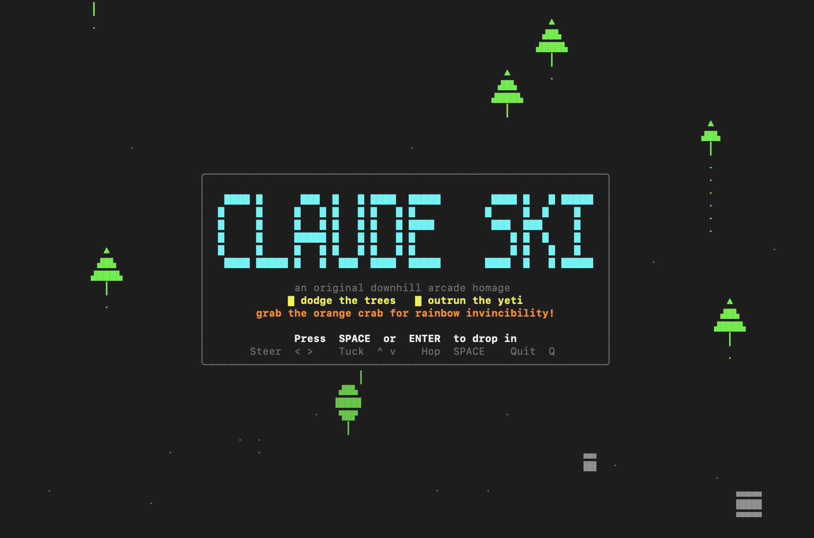

# Claude Ski ⛷

A playable, **terminal** downhill skiing arcade game for Claude Code — an
original ASCII/ANSI homage to the classic 1990s downhill skiing games. It runs
entirely inside your terminal (no browser, no GUI window), takes over the
screen with the alternate buffer and raw keyboard input, and restores
everything cleanly when you quit.



Steer your skier down an endless slope, dodge trees and rocks of all sizes,
launch off jumps for bonus points, build up speed and distance... and then
outrun the abominable **yeti** that wakes up and hunts you down after about
thirty seconds of skiing.

```
 SCORE 000217  DIST   217m  SPD  46  TIME 0:22  CRASH 1
[<>] steer  [^v] tuck  [space] hop  [p]ause  [q]uit     YETI 7m behind
|           ▲                                                          |
|         ·▟█▙                                                         |
|         ▟███▙                                                        |
|           ┃                 █                                        |
|      ▲                     ▟█▙                                       |
|     ▟█▙                    ╱ ╲         ·                             |
|      ┃        ▲                                                      |
|              ▟█▙                                                     |
|             ▟███▙                                                    |
|            ▟█████▙                \▄▄▄/                              |
|               ┃                   (◉ ◉)                              |
|                                    ███                               |
|                 ·                  ╱ ╲                               |
|                                       ♣♣                             |
```

(The `█ / ▟█▙ / ╱ ╲` figure is you. The `\(◉ ◉)/` further down the slope is
the yeti, closing in.)

> This is an **original work**. It does not use any names, art, sprites, or
> assets from any existing commercial game, and it is **not affiliated with,
> endorsed by, or derived from** the original *SkiFree* or its rights holders.
> It is an independent homage to the genre of 1990s downhill skiing arcade games.

---

## What this plugin does

Installing the plugin adds a single slash command:

```
/claude-ski:play
```

which launches the bundled Python game (`scripts/claude-ski.py`) in your
terminal. The game is a self-contained, deterministic arcade loop — it does
**not** use the model to play. Python 3 standard library only; no dependencies.

Features:

- Downhill scrolling slope with the skier near the upper-middle of the screen
- Steer left/right, ease up or tuck for speed, and hop to clear obstacles
- Multi-cell obstacles in several sizes — small/medium/large pines, bushy trees,
  small and large rocks, shrubs, and jump ramps; crash into solid ones, soar off ramps
- A rare **orange Claude crab** power-up: grab it for **15 seconds** of rainbow-
  flashing **total invincibility** — plow through trees and rocks for bonus points, and
  if you ram the yeti while invincible it **explodes** for a big bonus (then regroups
  and resumes the chase)
- Score from distance survived plus jump bonuses; speed ramps up over time
- A relentless animated yeti that wakes up after about 30 seconds and ends the run if it catches you
- Animated title screen with scenery scrolling past behind a protected menu card,
  a big block-letter **CLAUDE SKI** banner, plus pause and game-over screens and a compact HUD
- Launches from `/claude-ski:play` into a real terminal window and reports your
  score recap back to the Claude Code window when the run ends
- Unicode glyphs with an automatic ASCII fallback, optional ANSI color
- Alternate-screen mode, hidden cursor, raw input, and guaranteed terminal restoration on exit, crash, or Ctrl-C
- Resize handling and a "terminal too small" guard

---

## Install locally in Claude Code

The plugin ships with its own tiny local **marketplace** manifest
(`.claude-plugin/marketplace.json`), so you can add it straight from the folder.

From the directory that contains the `claude-ski/` folder:

**Interactive (inside Claude Code):**

```
/plugin marketplace add ./claude-ski
/plugin install claude-ski@claude-ski-marketplace
```

**Or from your shell (CLI):**

```bash
claude plugin marketplace add ./claude-ski
claude plugin install claude-ski@claude-ski-marketplace
```

Then run the game by typing **`/claude-ski`** (the menu autocompletes it to the
plugin's namespaced command):

```
/claude-ski:play
```

> **How launching works.** A full-screen terminal game needs a real keyboard,
> which the Claude Code tool subprocess does not have. So `/claude-ski:play`
> runs `scripts/claude-ski.py --launch`, which **opens the game in a new
> terminal window** (a real TTY) and waits for your run to finish. When you
> quit or get caught, it prints a **score recap** (score, distance, time, top
> speed, jumps, crashes, yetis blasted, session best) back into the Claude Code
> window. On macOS the new window is opened via `osascript` (Terminal.app) — the
> first time, macOS may ask permission to control Terminal.
>
> (Plugin slash commands are always namespaced as `/<plugin>:<command>`, so the
> bare `/claude-ski` resolves through the autocomplete menu rather than directly.)

To update or remove later:

```bash
claude plugin uninstall claude-ski@claude-ski-marketplace
claude plugin marketplace remove claude-ski-marketplace
```

> `defaultEnabled` is set to `true`, so the plugin is active as soon as it is
> installed (supported on recent Claude Code versions; older versions simply
> ignore the field).

---

## Run the game directly (no plugin needed)

The game is just a standalone Python script — you can run it without Claude Code:

```bash
python3 claude-ski/scripts/claude-ski.py
```

Command-line options:

```bash
python3 scripts/claude-ski.py            # play (auto-detects Unicode + color)
python3 scripts/claude-ski.py --ascii    # force plain-ASCII glyphs
python3 scripts/claude-ski.py --no-color # disable ANSI colors
python3 scripts/claude-ski.py --seed 123 # deterministic obstacle stream
python3 scripts/claude-ski.py --self-test# run headless sanity checks, then exit
python3 scripts/claude-ski.py --launch   # open the game in a NEW terminal window
                                         #   and print a score recap when it ends
python3 scripts/claude-ski.py --results /tmp/r.json  # write a JSON run summary on exit
```

`--launch` is what the `/claude-ski:play` command uses. Run directly (no
`--launch`) when you're already in a real terminal.

---

## Controls

| Key | Action |
| --- | --- |
| `←` / `→`  or  `A` / `D` | Steer left / right |
| `↑` / `↓`  or  `W` / `S` | Ease up (slow) / tuck (faster, riskier) |
| `Space` | Hop — brief hang time to clear an obstacle |
| `P` | Pause / resume |
| `Q` / `Esc` / `Ctrl-C` | Quit |
| `R` | Restart (from the game-over screen) |
| `Space` / `Enter` | Start (from the title screen) |

**Tip:** crashing into a tree or rock costs you speed and lets the yeti gain
ground. Cleanly clearing a jump pushes the yeti back. Tuck for speed on open
stretches, but you steer harder when you do. And if you spot the rare **orange
Claude crab**, grab it — 15 seconds of rainbow invincibility lets you smash
through a whole forest for bonus points, and ramming straight into the yeti
while it's active blows the yeti up for a huge bonus.

---

## Troubleshooting terminal rendering

- **"claude-ski needs an interactive terminal (a real TTY)."**
  The game requires a live keyboard and the alternate screen, so it cannot run
  inside a captured/piped subprocess. If Claude launches it through a tool and
  you see this notice, start it yourself from your own terminal. In the Claude
  Code prompt you can type the leading `!` to run it in your session:
  ```
  ! python3 "${CLAUDE_PLUGIN_ROOT}/scripts/claude-ski.py"
  ```
  or just run `python3 claude-ski/scripts/claude-ski.py` in a normal shell.

- **Garbled glyphs / boxes / wrong characters.** Your terminal or locale may
  not handle Unicode. Run with `--ascii`. (The game auto-detects this from your
  encoding/locale, but `--ascii` forces it.)

- **No color, or weird color codes printed literally.** Use `--no-color`.
  Color is disabled automatically when output is not a TTY.

- **"Terminal too small — resize me".** The play area needs at least **32×16**
  characters. Enlarge the window (or reduce font size) and the game resumes
  automatically.

- **Flicker.** The renderer is double-buffered and only redraws changed rows,
  targeting ~24 FPS. A terminal with very slow scrollback or an SSH session
  with high latency may still flicker; a local terminal is smoothest.

- **My terminal looks broken after a crash.** The game restores the terminal on
  normal exit, exceptions, and Ctrl-C. In the unlikely event something is left
  in a bad state, run `reset` (or `printf '\e[?25h\e[?1049l\e[0m'`) to restore
  the cursor and leave the alternate screen.

---

## Validate the plugin

```bash
# Validate the plugin + marketplace manifests
claude plugin validate ./claude-ski

# Run the game's own headless self-tests (terminal-restore safety,
# collision logic, score/distance/speed progression, yeti activation,
# input parsing, headless init without raw mode)
python3 claude-ski/scripts/claude-ski.py --self-test
```

Both should report success (`✔ Validation passed` and `N/N checks passed`).

---

## Project layout

```
claude-ski/
├─ .claude-plugin/
│  ├─ plugin.json          # plugin manifest
│  └─ marketplace.json     # tiny self-contained local marketplace
├─ skills/
│  └─ play/
│     └─ SKILL.md          # defines /claude-ski:play
├─ scripts/
│  └─ claude-ski.py        # the game (stdlib only)
├─ assets/
│  └─ title-screen.png     # README screenshot
├─ README.md
└─ LICENSE                 # MIT
```

The code is intentionally small and hackable. The simulation
(`Game.update`) is separated from rendering (`Renderer`) and from terminal
control (`Terminal`), so the logic is unit-testable without a TTY — see the
`--self-test` mode and the small entity/helper classes (`Player`, `Obstacle`,
`Monster`, `collides`, `crossed_line`).

---

## License

MIT — see [LICENSE](LICENSE).
